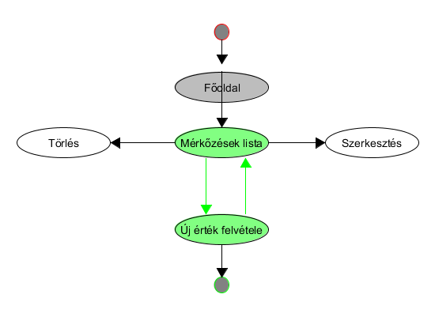
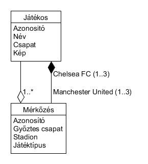
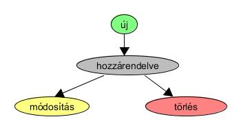
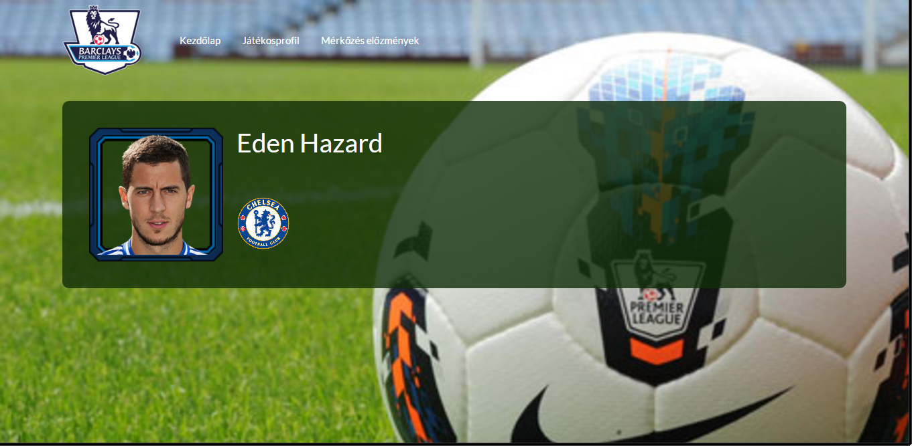
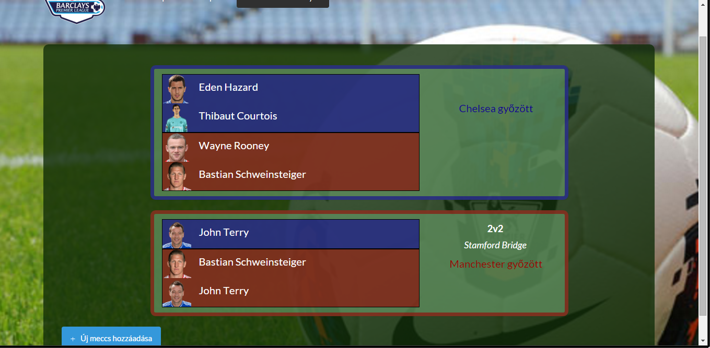
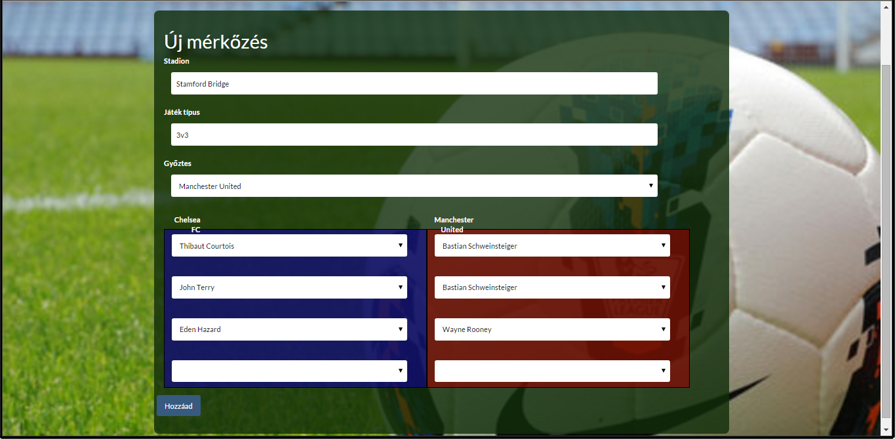

# Chelsea FC vs Manchester United

## Követelményanalízis 
**(A programnak tartalmaznia kell):**

### Funkcionális elvárások

•	legalább két modellt, egy-sok kapcsolatban

•	legalább 1 űrlapot

•	legalább 1 listázó oldalt

•	legyen lehetőség új felvételére

•	legyen lehetőség meglévő szerkesztésére

•	legyen lehetőség meglévő törlésére

### Nem funkcionális követelmények
•	REST API végpont kialakítása

•	szerveroldali perzisztálás fájlba

### Szerepkörök
•	Felhasználó: Láthatja a játékos profilját, valamint a harcok listáját, ahol újakat csinálhat, valamint törölheti vagy szerkeszti a már meglévő eredményeket.

### Használatieset-modell

## Tervezés

### Architektúra terv

Oldaltérkép

  Publikus:
  
  •	Kezdőlap
  
  •	Profil
  
  •	Eredmények
  
    +	új mérkőzés
    
    +	mérkőzés módosítása
    
    +	mérkőzés törlése

Végpontok

•	GET /: főoldal

•	GET /profile: Játékos profilja

•   GET /history: mérkőzések története részletes adatokkal

•	GET /new-match: új mérkőzés létrehozásának oldala

•	GET /edit-match{id}: meglévő mérkőzés módosítása

•	GET /delete{id}: meglévő mérkőzés törlése

### Osztálymodell
  Adatmodell
    
  Állapotdiagram
    

### Felhasználói felület:

### Profil

Az éppen aktuális profil megtekintése.

### History

### Új mérkőzés hozzáadása

Egy új mérkőzés hozzáadása a mezők megfelelő kitöltésével.

### Mérkőzés módosításás
Lehetőség van egy meglévő mérkőzés módosítására és törlésére, ha az egeret az adott esemény felé visszük az egeret.

## Implementáció

### Fejlesztői környezet:
Az alkalmazás a Cloud9 online fejlesztői környezetében készült Ember.JS technológiával.

### Könyvtárstruktúrában lévő mappák
•	docs/images: A dokumentációhoz szükséges képeket tartalmazza

•	app/models: A match és a player egyedek modelljeit tartalmazza

•	app/controllers: A mérkőzésekhez szükséges műveletek fájljait tartalmazza

•	app/adapters: Az api-val való összekötéshez szükséges fájlt tartalmazza

•	app/routes: A végpontokhoz szükséges fájlokat tartalmazza

•	app/styles: A megjelenlésért (design) felelős fájlt tartalmazza

•	app/templates: Az oldal megjelenítéséért felelő fájlokat tartalmazza

•	app/templates/components: Az oldal megjelenítéséért felelő kisebb, ismétlődő részeket tartalmazza

•	node_modules: A programhoz szükséges telepített elemeket tartalmazza

•	public/assets/images: Az oldal felépítéséhez használt képeket tartalmazza

## Felhasználói dokumentáció
### Menü
•	Premier League logo : Ide kattintva a Kezdőlapra navigálunk át.

•	Kezdőlap : Ide kattintva szintén a Kezdőlapra navigálunk át.

•	Játkosprofil : Ide kattintva láthatjuk a játékos profilját a részletes adatokkal.

•	Mérkőzés előzmények : Ide kattintva navigálunk át a meglévő eredmények listájára, valamint itt tudunk újabb mérkőzéseket felvenni.

### History

A lista tetején található "+ Új meccs hozzáadása" gombbal vihetünk fel az adatbázisunkba új mérkőzést.
Minden eredményt a saját módosító ikonjával módosíthatunk.
Minden eredményt a saját törlő ikonjával törölhetünk.

Itt jelennek meg az eredmények az alábbi adataikkal:

•	Stadion: melyik stadionban játszódott a mérkőzés (pl: Stamford Bridge)

•	Játéktípus : milyen típusú játék volt (pl: 2v2)

•   Győztes: melyik csapat diadalmaskodott

•	Az ellenfelek felsorolása
